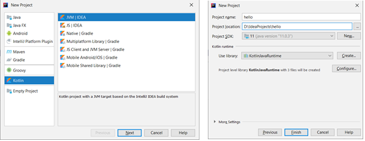
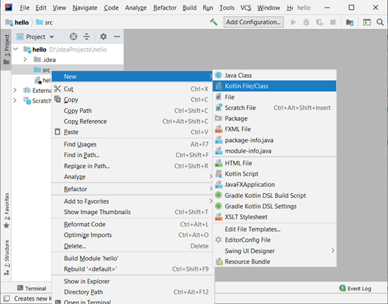
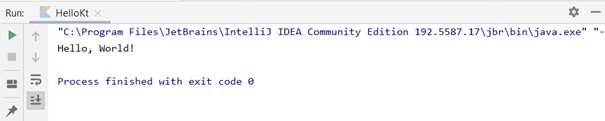

= Лабораторна робота № 1

:icons: font

== Частина 1. Знайомство з інтегрованим середовищем розробки програм IntelliJ IDEA.

*Мета лабораторної роботи*: придбання первинних практичних навичок роботи в середовищі програмування IntelliJ IDEA.

*Перед виконанням лабораторної роботи студент повинен знати*: призначення основних елементів вікна IntelliJ IDEA;
основні елементи управління вікном IntelliJ IDEA;
структуру та призначення основних елементів формату програми;
призначення операторів програми і коментарів;
призначення й способи використання динамічної довідки.

*Після виконання лабораторної роботи студент повинен вміти*: створювати проект із використанням стандартного шаблону; здійснювати введення й редагування тексту програми; знаходити та усувати помилки, які виникли на етапі написання коду програми.

=== Розробка простого консольного застосування
Запустіть IntelliJ IDEA, для чого виберіть відповідне посилання у Головному меню ОС,
або двічі клацніть мишкою по ярлику застосування, якщо він виведений на робочий стіл.
Після цього на екрані з'явиться вітальне (Welcome) вікно інтегрованого середовища розробки IntelliJ IDEA

.Стартове (вітальне вікно IDEA)
image::pic/1.png[]

Для створення консольного застосування оберіть New Project. З'явиться діалогове вікно New Project. Якщо вікно, що з'явилось, має інший вигляд, оновіть плагін Kotlin.

.Створення консольної програми мовою Kotlin

У цих вікнах оберіть тип проекту (Kotlin – JVM|Console Application), вкажіть ім’я проекту (Name:),
оберіть місце розміщення проекту (Location:) та систему збирання (Build System – наприклад, IntelliJ),
та JDK (наприклад, 11.0.x) натисніть Next.
У наступному вікні вкажіть Target JDK (1.8) та версію фреймворку тестування (JUnit5).
IntelliJ IDEA створить порожній проект  та відкриє його у головному вікні (рисунок 3)

.Стартовий шаблон програми мовою Kotlin

Відкрийте файл main.kt, який знаходиться у каталозі src/main/kotlin.
У вікні, що з’явиться, буде відображено текст простої програми. Його можна змінити на такий (дещо спрощений):

[source,kotlin]
----
fun main() {
    println("Hello, World!")
}
----

Запустіть програму на виконання клацнувши мишкою зелений трикутник, або натисніть *Ctrl+Shift+F10*.
У вікні виведення ви побачите результат роботи програми – вітання `“Hello, World!”`

=== Порядок виконання роботи й методичні рекомендації до її виконання:

. створити на робочому диску папку для проектів (ім'я папки повинне містити вичерпну інформацію про її користувача); запустити застосування IntelliJ IDEA;
. ознайомитися з елементами вікна IntelliJ IDEA;
. ознайомитися з командами кожного пункту головного меню;
. ознайомитися з елементами управління вікном IntelliJ IDEA;
. отримати у викладача навчально-демонстраційну програму або скористатися програмою, яка використовується в попередньому описанні середовища;
. виконати дії з введення, редагування, налагодження та збирання виконуваного модуля навчально-демонстраційної програми;
. підсумковий запуск виконуваного модуля виконати з командного рядка.

=== Контрольні запитання:

. Назвіть основні етапи розробки програми на ПЕОМ.
. Назвіть основні елементи вікна застосування IntelliJ IDEA.
. Назвіть основні органи управління вікном застосування IntelliJ IDEA.
. Перерахуйте основні операції з редагування тексту програми.
. Чим відрізняється оператор мови програмування Kotlin від коментаря?  

== Частина 2. Розв’язання задач лінійного характеру

*Мета лабораторної роботи*: отримання практичних навичок з підготовки, налагодження та виконання лінійних програм.

*Перед виконанням лабораторної роботи студент повинен знати*:

- класифікацію базових типів даних і їх основні характеристики;
- лексичні основи мови Kotlin  – поняття: змінна, вираз, операнд, константа, оператор;
- пріоритети операцій;
- правила перетворення типів;
- основні бібліотечні математичні функції мови Kotlin.

*Після виконання лабораторної роботи студент повинен вміти*:

- складати лінійні програми з використанням стандартних бібліотечних функцій;
- виконувати налагодження та покрокове тестування лінійних програм.

=== Короткі теоретичні відомості

_Алфавіт мови Kotlin, ідентифікатори та ключові слова_

Для програмування завдань лінійного характеру, в яких операції виконуються в природному порядку, тобто в порядку їх запису в програмі,
необхідно знати такі конструкції мови Kotlin:
ідентифікатори, службові слова, описи даних, вирази, оператори, вбудовані функції.
Вирази в мові Kotlin записуються за допомогою 26 рядкових та 26 прописних літер
англійського алфавіту:
`abcdefghijkImnopqrstuvwxyz`, `ABCDEFGHIJKLMNOPQRSTUVWXYZ` (припустимі також літери кирилиці);
десяти цифр: `0123456789`; таких спеціальних символів: `+ - * / =, . _ : ; ? \ " ’~ | ! # $ & ( ) [ ] { } ^ @`.

NOTE: До спеціальних символів відноситься також пропуск.
Комбінації деяких символів, не розділених пропусками, інтерпретуються як один значущий символ:
`++ -- || && << >> >= <= == != += -= *= /= .?: :: /* */ //`

*Ідентифікаторами* називаються імена, що надають змінним, константам, типам даних і функціям, які використовуються в програмах. Після опису ідентифікатора, можна посилатися на об'єкт, що позначається ним.
Ідентифікатор – це послідовність символів довільної довжини, яка містить літери, цифри й символи підкреслення, обов'язково починається з літери, або символу підкреслення.
У Kotlin враховується регістр букв.
Компілятор сприймає прописні і рядкові букви, як різні символи.
Так, змінні `userName` та `UserName` розглядаються як два різні ідентифікатори

Ключові слова є зарезервованими ідентифікаторами, кожному з яких відповідає певна дія.
Змінити призначення ключового слова неможливо.
Імена ідентифікаторів, що створюються в програмі, не повинні збігатися з ключовими словами мови Kotlin (іноді дозволяється використовувати у якості ідентифікаторів soft keywords та modifiers, проте цього краще не робити).

*Hard Keywords*

[cols="7*"]
|===

|as
|break
|class
|continue
|do
|else
|false
|for
|fun
|if
|in
|interface
|is
|null
|object
|package
|return
|super
|this
|throw
|true
|try
|typealias
|typeof
|val
|var
|when
|while
|===

*Soft Keywords*
[cols="6*"]
|===
|by
|catch
|constructor
|delegate
|dynamic
|field
|file
|finally
|get
|import
|init
|param
|property
|receiver
|set
|setparam
2+|where

|===

*Modifiers*
[cols="6*"]
|===
|actual
|abstract
|annotation
|companion
|const
|crossinline
|data
|enum
|expect
|external
|final
|infix
|inline
|inner
|internal
|lateinit
|noinline
|open
|operator
|out
|override
|private
|protected
|public
|reified
|sealed
|suspend
|tailrec
2+|vararg

|===

__Стандартні типи даних, модифікатори, кваліфікатори доступу й перетворення типів
__

Кожна програма обробляє певну інформацію.
У Kotlin дані мають один з базових типів: `*Char*` (текстові дані), `*Int*` (цілі числа),
`*Float*` (числа з плаваючою точкою одинарної точності), `*Double*` (числа з плаваючою точкою подвійної точності),
`*Unit*` (порожні значення), `*Boolean*` (логічні значення) та інші.
Текстом (тип даних `*Сhar*`) є один символ.
Зазвичай кожен символ займає 16 біт або два байти.
Цілі числа (тип даних `*Int*`) знаходяться в діапазоні від `–2147483648` до `2147483647`.
У Kotlin підтримуються чотири типи цілих чисел.
Разом із стандартним типом `*Int*` існують типи `*Byte*`, `*Short*`, `*Long*`.
Числа з плаваючою точкою одинарної точності (тип даних `*Float*`) можуть бути представлені як у фіксованому форматі,
так і в експоненціальному. Діапазон значень – від `±3.4Е-38` до `±3.4Е+38`,
розмірність – 32 біта, тобто 4 байти або 2 слова.
Числа з плаваючою комою подвійної точності (тип даних `*Double*`) мають діапазон значень від
`±1.7Е-308` до `±1.7Е+308` і розмірності 64 біт, тобто 8 байтів або 4 слова.
Тип даних `*Unit*`, як правило, застосовується у функціях, що не повертають ніякого значення.
Змінні логічного типу даних `*Boolean*` в Kotlin можуть містити тільки одну з двох констант: `true` або `false`.
Іноді потрібне, щоб значення змінної залишалося постійним протягом всього часу існування змінної.
Такі змінні називаються константними. Наприклад, якщо в програмі обчислюється довжина кола або площа круга, часто доводиться оперувати числом π (3,1415926). Для оголошення константних змінних використовується ключове слово val у той час, як для інших змінних (що мутують)  – var.
Часто буває, коли в операції беруть участь змінні різних типів.
Такі операції називаються змішаними. Деякі з них дозволені, а деякі – заборонені.
Наприклад:

[source,kotlin]
----
var a = 2
var res = 3.7
a = a * res     //Помилка!
----

У процесі виконання змішаних операцій компілятор намагається автоматично проводити перетворення типів даних.
Цілочисельне значення змінної a зчитується з пам'яті, приводиться до типу з плаваючою точкою та помножується
на початкове значення змінної res, отримуємо 7,4.
Результат у вигляді значення з плаваючою точкою присвоюється змінній цілого типу `a`,
отримуємо помилку через звужуюче перетворення.
Автоматичні перетворення типів даних при виконанні змішаних операцій здійснюються відповідно до ієрархії перетворень.
Суть полягає в тому, що з метою підвищення продуктивності, в змішаних операціях значення різних типів тимчасово
приводяться до того типу даних, який має більший пріоритет в ієрархії.
Нижче перераховані типи даних у порядку зниження пріоритету:
`*Double*`, `*Float*`, `*Long*`, `*Int*`, `*Short*`, `*Byte*`.

Якщо значення перетвориться на тип, що має більшу розмірність, не буде мати місця втрата інформації, унаслідок чого не страждає точність обчислень, такі автоматичні перетворення дозволяються. Наприклад:
[source,kotlin]
----
var a = 2
var res = 3.7
res = a * res     //операція дозволена
----

Іноді потрібно змінити тип змінної, не чекаючи автоматичного перетворення. Для цього призначена операція приведення типу. Якщо в програмі необхідно тимчасово змінити тип змінної, потрібно явно викликати операцію перетворення до відповідного типу даних. Наприклад:
[source,kotlin]
----
r = v + (a / b).toFloat()
r = v + a / b.toFloat()
r = v + a.toFloat() / b.toFloat()
----

У всіх трьох випадках перед виконанням ділення відбувається явне приведення значення однієї або двох змінних до типу `*Float*`.

_Операції_

Kotlin включає побітові операції, операції інкрементування й декрементування, умовну операцію,
операції  комбінованого присвоєння.
Побітові операції працюють із змінними як із наборами бітів, а не як із числами.
Ці операції використовуються в тих випадках, коли необхідно отримати доступ до окремих бітів даних
(наприклад, при виведенні графічних зображень на екран).
Побітові операції застосовуються тільки до цілочисельних значень.
На відміну від  логічних операцій, із їх використанням порівнюються не два числа цілком, а окремі їхні біти.
Основні побітові операції: «І» (`*and*`), «АБО» (`*or*`) і «Виключне АБО» (`*xor*`).
Сюди можна також зарахувати унарну операцію побітового інвертування (`*inv*`),
яка інвертує значення бітів числа.
Операція `*and*` записує в біт результату одиницю тільки в тому випадку, якщо обидва порівнюваних біта дорівнюють 1.
Ця операція часто використовується для маскування окремих бітів числа. Наприклад: `0xF1 *and* 0x35 = 0x31`.
Операція `*or*` записує в біт результату одиницю в тому випадку, якщо хоч би один з порівнюваних бітів дорівнює 1.
Ця операція часто застосовується для установки окремих бітів числа. Наприклад: `0xF1 *or* 0x35 = 0xF5`.
Операція `*xor*` записує в біт результату одиницю в тому випадку, якщо порівнювані біти відрізняються один від одного.
Ця операція часто застосовується при виведенні зображень на  екран, коли відбувається накладення декількох графічних шарів.
Наприклад: `0xF1 *xor* 0x35 = 0xC4`.

[cols="5*^"]
|===
|*a* | *b* | *a and b* | *a or b* | *a xor b*

|0 |0 |0 |0 |0
|0 |1 |0 |1 |1
|1 |0 |0 |1 |1
|1 |1 |1 |1 |0
|===
У Kotlin існує дві операції зсуву: `shl` - зсув ліворуч, `shr` - зсув праворуч. Дія першої операції полягає в зсуві бітового представлення цілочисельної змінної, вказаної зліва від операції,  ліворуч на кількість бітів, задану праворуч від операції. При цьому звільнені молодші біти заповнюються нулями, а відповідна кількість старших бітів втрачається.
Зсув беззнакового числа на одну позицію ліворуч із заповненням молодшого розряду нулем еквівалентний множенню числа на 2.
Наприклад:
[source,kotlin]
----
var a = 65 	            // молодший байт: 01000001
a = a shl 1  	            // молодший байт: 10000010
println(a)  	 	 	  // буде виведене 130
----

Зсув праворуч супроводжується аналогічними діями, тільки бітове представлення числа зрушується на вказану кількість бітів управо. Значення молодших бітів втрачаються, а старші біти, що звільнилися, заповнюються нулями, якщо операнд беззнаковий, і значенням знакового біта інакше. Таким чином, зсув беззнакового числа на одну позицію праворуч еквівалентне діленню числа на два:
[source,kotlin]
----
var a = 10          // молодший байт: 00001010
a = a shr 1         // молодший байт: 00000101
println(a)          // буде виведене 5
----

Збільшення (зменшення) значення змінної на 1 дуже часто зустрічається в програмах, тому розробники мови Kotlin передбачили для цих цілей спеціальні операції інкрементування (++) і декрементування (--).
Так, замість рядка `a+1`, можна ввести рядок `a++`  або `++a`

За ситуації, коли операція ++ є єдиною у виразі, не має значення місце її розташування: до імені змінної або після нього. Значення змінної в будь-якому випадку збільшиться на одиницю.
У процесі роботи з складними виразами необхідно уважно стежити, коли саме відбувається модифікація змінної. Потрібно розрізняти префіксні й постфіксні операції, які ставляться відповідно до або після імені змінної.
Наприклад, при постфіксному інкрементуванні i++ спочатку повертається значення змінної, після чого воно збільшується на одиницю. З іншого боку, операція префіксного інкрементування ++i вказує, що спочатку слід збільшити значення змінної, а потім повернути його як результат. Наприклад: нехай i=3, тоді
[source,kotlin]
----
k = ++i  // набувають значення i=4, k=4
k = i++   //спочатку k=4, потім i збільшиться на одиницю (i=5)
k = --i   //спочатку зменшиться на одиницю i=4, k=4
k = i--   //k=4,i=3
----

У Kotlin представлені всі стандартні арифметичні операції: складання (+), віднімання (–), множення (*), ділення (/) і ділення по модулю (%). Перші чотири операції не вимагають роз'яснень. Суть операції ділення по модулю:
[source,kotlin]
----
var a = 3
var b = 8
var d = b % a   // результат: 2
----

NOTE: При діленні по модулю повертається залишок від операції ділення націло

[cols="1,1,3"]
|===
^|*Початковий оператор* ^|*Еквівалент* ^| *Коментар*

| `v = v + 3` | `v += 3`
| до змінної додається 3
| `v = v - 10` | `v -= 10`
| Від змінної віднімається 10
| `v = v * 3.14` | `v *= 3.14`
| Змінна помножується на 3.14
| `v = v / 2.5` | `v /= 2.5`
| Змінна ділиться на 2.5
| `v = v % 2` | `v %= 2`
| Отримання залишку при діленні v на 2
| `v = v + 1` | `v++`
| Операція інкремента
| `v = v - 1` | `v--`
| Операція декремента
|===

Операції порівняння призначені для перевірки рівності або нерівності порівнюваних операндів.
Усі вони повертають true у разі встановлення істинності виразу і false інакше.
Нижче перераховані оператори порівняння, використовувані в мові Kotlin

[cols="1,5"]
|===
^|*Операція* ^|*Виконувана перевірка*

| == | Дорівнює
| != | Не дорівнює
| > | Більше
| < | Менше
| &lt;= | Менше, або дорівнює (не більше)
| >= | Більше, або дорівнює (не менше)

|===

Логічні операції І (&&), АБО (||) і НЕ (!) повертають значення true або false залежно від логічного відношення між їх операндами. Так, операція && повертає true, коли істинні (не дорівнюють нулю) обидва його аргументи. Оператор || повертає false тільки в тому випадку, якщо обидва його аргументи не є істинними (дорівнюють нулю). Оператор ! інвертує значення свого операнду з false на true і навпаки.
Послідовність виконання різних операцій визначається компілятором.
Якщо не враховувати порядок розбору виразу компілятором, можуть бути отримані неправильні результати.
У таблиці перераховані всі операції мови Kotlin в порядку зниження їх пріоритету і вказаний напрям обчислення
операндів (асоціативність): зліва направо або справа наліво

|===
|*Операція* |*Опис* |*Асоціативність*

|++
|Постфіксний (префіксний) інкремент
|Зліва направо
|--
|Постфіксний (префіксний) декремент
|
|()
|Виклик функції
|
|[]
|Доступ до елемента масиву
|
|.
|Прямий доступ до члена класу
|
|!
|Логічне НЕ
|
|inv
|Побітове НЕ
|
|-
|Унарний мінус
|
|+
|Унарний плюс
|
|*
|Множення
|Зліва направо
|/ |Ділення |
|% |Ділення по модулю |
|+ |Складання |Зліва направо
|- |Віднімання |
|shl |Зсув ліворуч |Зліва направо
|shr |Зсув праворуч |
|< |Менше |Зліва направо
|> |Більше |
|&lt;= |Менше або дорівнює |
|>= |Більше або дорівнює |
|== |Дорівнює |Зліва направо
|!= |Не дорівнює |
|and |Побітове І |Зліва направо
|xor |Побітове виключаюче АБО |Зліва направо
|or |Побітове АБО |Зліва направо
|&& |Логічне І |Зліва направо
|&#124;&#124; |Логічне АБО |Зліва направо
|= |Просте присвоювання |Справа наліво
|*= |Присвоювання з множенням |
|/= |Присвоювання з діленням |
|%= |Присвоювання з діленням по модулю |
|+= |Присвоювання із додаванням |
|-= |Присвоювання з відніманням |

|===

У мові Kotlin усі стандартні функції знаходяться у бібліотеках,
які можна підключити за допомогою імпорту з пакетів Kotlin та/або Java.
Обчислення у програмах на Kotlin неможливі без використання математичних функцій,
які описані у файлі пакеті kotlin.math (або у класі java.lang.Math)

*Розглянемо приклад*: Знаходження значення похідної функції в точці.
*Постановка завдання*: Задана функція `y=sin(x)`. Знайти її похідну в точці `x= π /2`.
Для знаходження похідної в точці використовується відомий вираз:

\[y'(x) \approx \frac{f(x+\Delta x)-f(x)}{\Delta x} \]

[source,kotlin]
----
import kotlin.math.sin

fun main() {
    val dx = 1.0e-11
    val x = 3.1415926
    val f1 = sin(x+dx)
    val f2 = sin(x)
    val pf = (f1-f2)/dx
    println("dsin(x)/dx = $pf x = $x")
}
----
*Стандартні математичні функції мови Kotlin*

Посилання на опис на офіційному сайті https://kotlinlang.org/api/latest/jvm/stdlib/kotlin.math/index.html[]

*Контрольні питання:*

.	Пояснить сенс поняття "оператор".
.	Що розуміється під типом даних?
.	Яка інформація повідомляється компілятору при оголошенні змінних і констант?
.	Дайте визначення виразу.
.	Вкажіть правила обчислення виразів.
.	Наведіть приклади операцій з однаковим пріоритетом.
.	Вкажіть операції з найвищим і найменшим пріоритетом.

=== Завдання 1.1.
_Записати мовою Kotlin представлені математичні вирази_

[cols="1,3,3"]
|===
^| Варіанти ^| Вираз 1 ^| Вираз 2

^| 1-3
| \[\frac {ln\|2z\|+arctg2z^2} { 3 (z+1)^2 + 2,1 \cdot 10^{6}}\]
| \[ln\|x+z\|>0 \space та \space0<b<1 \]
^| 4-6
| \[\frac {ln\|5z\|+arctg^2z} { 3 (z+1)^2 + 2,1 \cdot 10^{-6}} \]
| \[ln\|x+z\|>0 \space або \space0<b<1 \]
^| 7-9
| \[\frac {10^{-7} ln\|2z\|+sin2z^3} { 3 (z+3)^2 + 2,1 \cdot 10^{7}} \]
| \[\|x+z\|>1 \space та \space 1 < b < 2\]
^| 10-12
| \[\frac {10^{-7} ln\|2z\|+b^{0.4}} { ln(z+1)^2 + 4,2 \cdot 10^{4}} \]
| \[ \|x\| > 2 \space або \space 0 < b < 3 \]
^| 13-15
| \[\frac {10^{-5} e^{-5f} + sin^2 \|z^3\|} {5(z+1)^5 + 10^6} \]
| \[x+z<0 \space або \space 0 < f < 0.2 \]
^| 16-18
| \[ \frac {10^{-4} e^{-2f} + ln \|z^3\|} {2(z+2)^{1.5}}\]
| \[ cos\|x+z\| > 0 \space або \space 0 < b < 3\]
^| 19-21
| \[\frac {ln\|3z\|+arctg2z^2} { 3 (z+1)^2 + 2,1 \cdot 10^{6}}\]
| \[\|x+z\|>0 \space та \space 0 < b < 7\]
^| 22-24
| \[\frac {10^{-7} sin\|3z\|+b^{1.2}} { ln(z+1)^2 + 1,2 \cdot 10^{6}} \]
| \[ln\|x+z\|>0 \space або \space 0 < b < 1\]
^| 25-27
| \[\frac {10^{-6} ln\|z^3 \|+ln^2 z^3} { 6 (z+1)^6 + 10^{6}} \]
| \[cos\|x+z\|>0 \space та \space 0 < b < 3\]
^| 28-30
| \[\frac {10^{-7} ln\|3z^3 \|+sin2z^2} { (z+1)^{0,5} + 10^{6}} \]
| \[\|x+z\|>0 \space або \space 0 < b < 1\]
^| 31-33
| \[\frac {ln\|4z\|+arctg^32z} { 4 (z+1)^{0,2} + 1,7 \cdot 10^{3}} \]
| \[\|x+z\|>0 \space та \space 0 < b < 7\]
^| 34-36
| \[ \frac {10^{-5} e^{-3f} + ln \|z^{-3}\|} {5(z+2)^{2.5}}\]
| \[x+z<0 \space та \space 0 < f < 0.2 \]

|===

=== Завдання 1.2.
_Представити математичний запис виразу, що записаний мовою Kotlin і показати порядок дій_
[cols="1,9"]
|===
^| Варіант ^| Завдання
| 1, 19
| `x+2.0/3.0/x/a+sqrt(sin(x))/2*sqrt(x)+1.0e-6*x.pow(1.0/7.0)`
| 2, 20
| `(x+7)/3*x+3*atan(x)/2/x+1.0e7-sqrt(1.0/3.0*x.pow(5))`
| 3, 21
| `x+2/3.0*x/a+sqrt(cos(x))/2/sqrt(x)+1.0e-5*x.pow(7)`
| 4, 22
| `(x+4)/3/x+exp(abs(atan(x)))/2*x+1.0e-6*x.pow(1.0/3)`
| 5, 23
| `x+2/3.0/x/a+sqrt(sin(x))/2.0/ln(x)+1.0e5*(x/3).pow(2/7.0)`
| 6, 24
| `1.4e-4*(2*x).pow(3)+sqrt(sin(x))/2+sqrt(cos(x))/2/x`
| 7, 25
| `sqrt(cos(x))/2/x-5.0/7.0*x/a/1.0e-6*(x/2).pow(1/3.0)*abs(x)`
| 8, 26
| `x+2.0/3/x*a+sqrt(sin(x))/2/ln(x)+1.0e-3*(x/7).pow(2.0/3)`
| 9, 27
| `(x+7)/3*x+3*atan(x)/2/x+1.0e7-sqrt(4*x.pow(b))`
| 10, 28
| `sqrt(cos(abs(x)))/2/x-5.0/7*x/a/1.0e-6*(x/2).pow(1.0/8.0)`
| 11, 29
| `x+9/(3*x/a)+sqrt(cos(x))/2/sqrt(x)+1.0e-5*x.pow(9)`
| 12, 30
| `x+4/3.0/x+exp(abs(atan(x)))/2*x+1.0e-4*x.pow(1.0/3.0)`
| 13, 31
| `sqrt(abs(cos(x)))/2/(x-5.0/7)*x/a/1.0e-6*(x/2).pow(5/3.0)`
| 14, 32
| `x+2*3/x*a+ln(abs(sin(x)))/(2*cos(x)+1.0e-3*(x/2).pow(1.0/7))`
| 15, 33
| `x+4.0/3/(x+abs(atan(x)))/2*x+1.0e-5*x.pow(5.0/3.0)`
| 16, 34
| `sqrt(cos(x))/2*x-4.0/3*x/a/1.0e8*(x/3).pow(2.0/3.0)*sin(x)`
| 17, 35
| `ln(x+5)/2*x+4*atan(x)/5/x+1.0e5-sqrt(4*x.pow(b/(2.0/3.0)))`
| 18, 36
| `x+5.0/(3*x/a)+ln(abs(cos(x)))/2/exp(x)+1.0e-5*x.pow(3)`

|===

=== Завдання 1.3.
_Скласти програму обчислення наступних величин, та виконати її у інтегрованому середовищі розробки (IDE)_
Позначення: N –номер варіанту за списком групи
[cols="1,9"]
|===
^|Варіанти ^|Умова

^|1
| Модуль вектора 5**a**+10**b**, якщо *a*={3; 2} і *b*={0; -1}
^|2-6
| Сума усіх парних чисел від 2 до 50**N*
^|7-11
| Сума усіх двозначних цілих чисел, які кратні N
^|12
| Кут між векторами *a*={1; 2} і *b*={1; -0,5}
^|13
| Площа чотирикутника з вершинами A(0; 0), B(-1; 3), C(2; 4), D(3; 1)
^|14
| Сума одинадцяти перших членів арифметичної прогресії, якщо a~3~+a~9~=8
^|15
| Периметр трикутника з вершинами A(1; 1), B(4; 1), C(4; 5)
^|16
| Модуль вектора -2**a** + 4**b**, якщо *a*={3; 2}, *b*={0; -1}
^|17
| Кути трикутника з вершинами A(0; 1,7), B(2; 1,7), C(1,5; 0,85)
^|18
| Шостий член геометричної прогресії 5, -10, ...
^|19
| Кут між векторами a={2; -4; 4} та b={-3; 2; 6}
^|20
| Модуль вектора *a*-*b*, якщо \|*a*\|=3, \|*b*\|=5 та ці вектори утворюють кут у 120º
^|21
| Сума усіх двозначних цілих чисел
^|22
| Модуль вектора *a*+*b*, якщо \|*a*\|=11, \|*b*\|=23, \|*a*-*b*\|=30
^|23
| Сума усіх непарних двозначних чисел
^|24-28
| Сума усіх тризначних цілих чисел, які у разі ділення на 5 дають остачу 28-*N*
^|29-32
| Сума усіх непарних чисел від 3 до 5**N*
^|33-36
| Сума усіх парних чисел від 10 до 7**N*

|===
